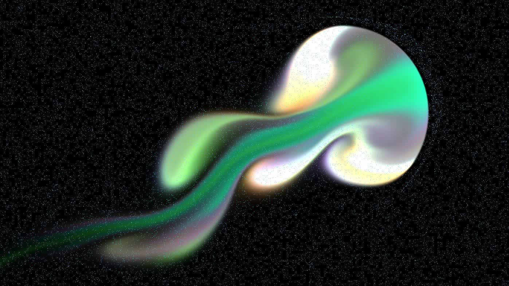
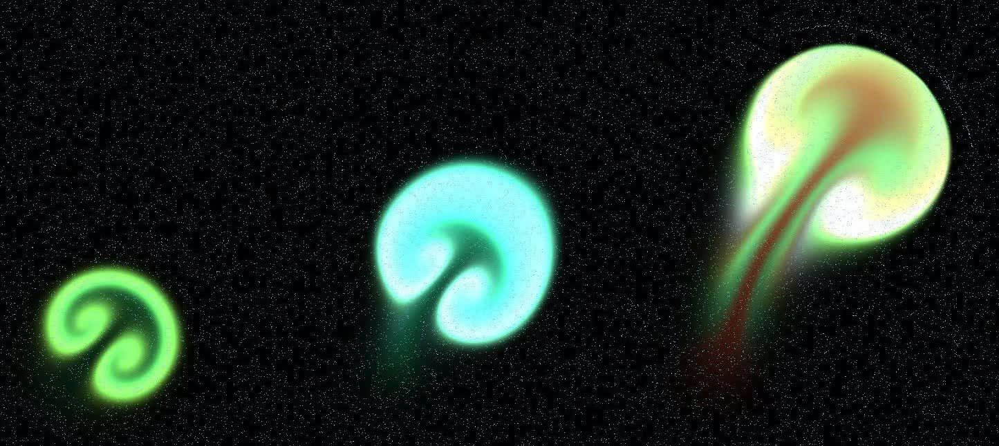

# WebGL 2D Fluid Simulation

## Start

**cd ./webgl-2d-fluid-simulation/server && node server.js**

## References

https://developer.download.nvidia.com/books/HTML/gpugems/gpugems_ch38.html

https://github.com/amandaghassaei/FluidSimulation

https://github.com/PavelDoGreat/WebGL-Fluid-Simulation
